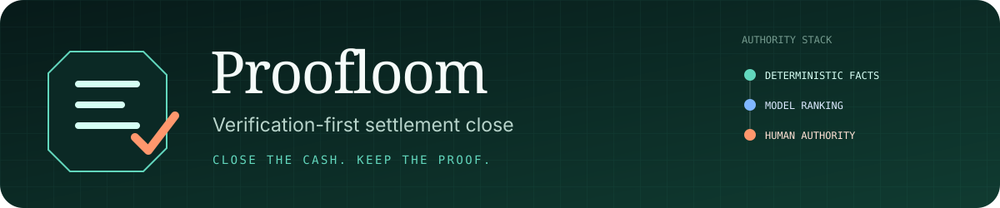
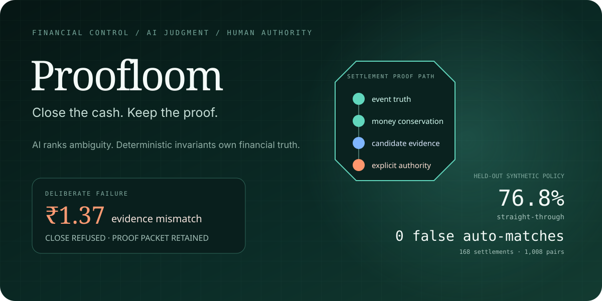
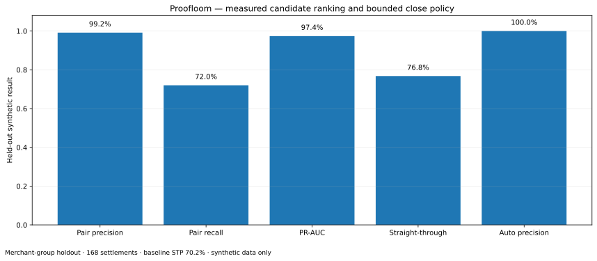

<p align="center">
  
</p>

<p align="center">
  <strong>Financial truth under ambiguity.</strong><br>
  AI ranks damaged evidence. Deterministic invariants and explicit human authority decide whether money can close.
</p>

<p align="center">
  <a href="#run-the-system"><strong>Run it</strong></a> ·
  <a href="docs/ARCHITECTURE.md"><strong>Architecture</strong></a> ·
  <a href="evaluation/results.md"><strong>Evaluation</strong></a> ·
  <a href="reports/FAILURE_RECOVERY_RESULTS.md"><strong>Failure lab</strong></a> ·
  <a href="docs/TECHNICAL_REPORT.md"><strong>Technical report</strong></a>
</p>



## The proposition

A plausible bank credit is not sufficient evidence for a safe settlement close.

Proofloom constructs a **proof path** across payment activity, refunds, fees, tax, settlement records, bank credits, event ordering, model evidence, policy constraints, and reviewer identity. A close is permitted only when that path survives deterministic checks.

The model never changes an amount, repairs a broken invariant, or grants itself authority.

```text
immutable evidence
      ↓
event normalization
      ↓
exact / split matching ── unresolved ambiguity ── local ranker
      ↓                                           ↓
      └──────────── deterministic close policy ───┘
                              ↓
              auto-match / review / block / abstain
                              ↓
                    hash-chained proof record
```

## The memorable failure

The fourth hero settlement appears operationally plausible, but source composition and the reported settlement differ by **137 paise**.

Proofloom does not round it away, ask the model to explain it away, or allow a reviewer to rewrite the amount.

> **Expected:** ₹37,178.14  
> **Reported:** ₹37,176.77  
> **Delta:** ₹1.37  
> **Decision:** `BLOCKED`


## What is actually implemented

The deterministic hero run contains **185 source records**:

| Evidence surface | Count |
|---|---:|
| Captured payments | 84 |
| Partial refunds | 6 |
| Settlements | 4 |
| Bank lines | 5 |
| Webhook deliveries | 86 |

It exercises four different decision paths:

1. exact UTR/reference evidence → automatic match;
2. damaged reference → local-model ranking → named human review;
3. two-credit exact split → automatic match;
4. 137-paise source contradiction → blocked before bank ownership is considered.

The same run also suppresses one duplicate event ID, normalizes an out-of-order delivery using event occurrence time, retains an unowned distractor credit, and produces a verifiable audit chain.


## Authority is separated by design

| Layer | What it may do | What it may not do |
|---|---|---|
| **Deterministic core** | normalize events; compute settlement composition; enforce integer-paise conservation; exact/split matching; date/direction checks | infer ownership from weak similarity |
| **Local model** | rank unresolved one-to-one candidates and expose feature evidence | change financial facts; bypass policy; approve a close |
| **Policy** | combine invariants, score, margin, and review rules | conceal contradictions or coerce a match |
| **Human reviewer** | approve or reject the proposed evidence | edit the amount or make a failed invariant pass |
| **Proof plane** | record evidence, reasons, actor, correlation ID, model version, and hash-chain state | provide durable production immutability by itself |


## Measured synthetic result

The benchmark is split by **merchant group**, not by random row: 16 merchant groups train the ranker, 4 select thresholds, and 4 remain held out. The test surface contains **168 settlements and 1,008 candidate pairs**.

### Candidate-pair ranker

| Metric | Held-out result |
|---|---:|
| Precision | **99.18%** |
| Recall | **72.02%** |
| F1 | **83.45%** |
| PR-AUC | **0.9738** |
| ROC-AUC | **0.9948** |
| Brier score | **0.0265** |
| 10-bin ECE | **0.0336** |

### Close policy

| Policy | Straight-through | Auto-match precision | Review queue | False auto-matches |
|---|---:|---:|---:|---:|
| Exact-evidence baseline | 70.24% | 100.0% | 50 | 0 |
| **Proofloom hybrid** | **76.79%** | **100.0%** | **39** | **0** |

The hybrid automation threshold (`0.60`) and score-margin requirement (`0.12`) were chosen on validation merchants only, subject to zero validation false auto-matches. On the damaged/ambiguous-only stress slice, the policy automated 11 of 50 cases and abstained on the rest.

The paired bootstrap median increase in straight-through coverage was **+6.55 percentage points**, with a retained synthetic resampling interval of **[+2.98, +10.71] points**.

These are generated-data observations, not production merchant accuracy, recovered money, savings, ROI, or accounting assurance. The full protocol, predictions, raw JSON, and limitations are retained in [`evaluation/`](evaluation/).



## Failure is part of the product

| Injected condition | Safe behavior |
|---|---|
| Duplicate webhook | same event ID is suppressed; no duplicate close decision is created |
| Model unavailable | exact and split paths continue; ambiguous evidence remains unresolved |
| Unsafe manual adjustment | requested amount change is rejected; financial facts remain immutable |
| Audit payload mutation | copied chain fails at the first altered link; live chain remains valid |
| False tie-out | 137-paise contradiction remains blocked before candidate ownership |

Reproduce them through the UI or inspect [`demo/failure_results.json`](demo/failure_results.json) and [`reports/FAILURE_RECOVERY_RESULTS.md`](reports/FAILURE_RECOVERY_RESULTS.md).

## Run the system

### Prerequisites

- Python 3.11+
- macOS, Linux, or WSL

```bash
git clone https://github.com/Krishna-V-Gowda/proofloom.git
cd proofloom
make setup
make run
```

Open `http://127.0.0.1:8000`, then run the daily close and inspect the four proof packets.

The local demo requires **no Razorpay key and no external model provider**.

### Reproduce the evidence

```bash
make test        # behavior, API, policy, adapter, audit, and evaluation tests
make seed        # export the fixed 185-record hero dataset
make evaluate    # regenerate held-out metrics, predictions, and figures
make benchmark   # run bounded local timing measurements
make security    # scan first-party public files for high-confidence secrets
make validate    # execute the complete fail-closed release gate
```

## Local benchmark boundary

On the retained container environment:

| Workload | Median | p95 |
|---|---:|---:|
| score 1,008 candidate pairs | 66.67 ms | 72.26 ms |
| four-settlement / 185-record close core | 1.64 ms | 2.19 ms |
| in-process overview API | 1.47 ms | 5.16 ms |

These include local process overhead and exclude production networking, persistence, multi-tenancy, browser rendering, and service-level objectives. Raw repetitions and environment details are in [`benchmarks/results.json`](benchmarks/results.json).

## Repository map

```text
src/proofloom/      immutable domain facts, generator, model, policy,
                    close engine, audit chain, service, API, and UI
tests/              domain, engine, service, API, adapter, audit, and evaluation
data/demo/          fixed-seed 185-record exported evidence
evaluation/         protocol, predictions, metrics, plots, and raw result
benchmarks/         bounded local timings and raw repetitions
demo/               hero result, audit snapshot, failure outputs, and runbook
docs/               architecture, methodology, threat model, ADRs, report
scripts/            release validation and public-tree security gate
```

## Razorpay boundary

`src/proofloom/razorpay_adapter.py` implements environment-only Basic Auth configuration, a hard test-key guard, raw-body HMAC-SHA256 webhook verification, typed reconciliation request construction, and retry-safe error mapping boundaries.

The committed demo intentionally uses official-shape synthetic fixtures. It does **not** execute real payments, refunds, payouts, settlements, or bank actions. Proofloom is an independent Buildathon project, not an official Razorpay product.

## Honest limitations

- all records and labels are synthetic and have not been adjudicated by merchant finance operators;
- statement-format drift, multi-currency behavior, cross-bank partial settlements, and long-lived correction workflows need field data;
- the service, review state, and audit ledger are in memory;
- production authentication, RBAC, tenant isolation, durable storage, and operational controls are not implemented;
- the hash chain is tamper-evident, not an externally anchored immutable ledger;
- generated evaluation is evidence of reproducible engineering behavior, not production generalization.

## Deep inspection

- [Architecture and financial invariants](docs/ARCHITECTURE.md)
- [Evaluation protocol](evaluation/EVALUATION_PROTOCOL.md)
- [Technical report](docs/TECHNICAL_REPORT.md)
- [Threat model](docs/THREAT_MODEL.md)
- [Failure recovery](reports/FAILURE_RECOVERY_RESULTS.md)
- [Synthetic data methodology](data/GENERATION_METHODOLOGY.md)
- [Source and protocol ledger](docs/SOURCE_LEDGER.md)

## License

[MIT](LICENSE)
