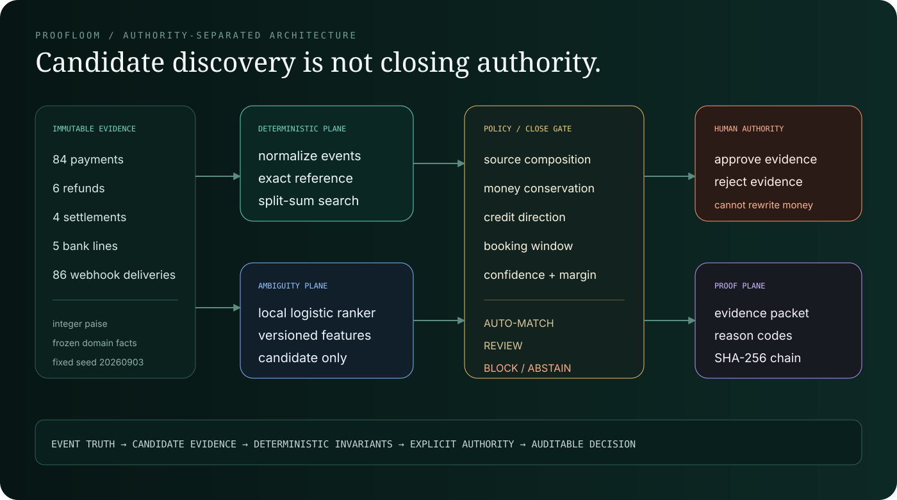

# Architecture



## Architectural proposition

Proofloom separates **candidate discovery** from **financial authority**.

A single cohesive Python process is intentionally used for the prototype. The meaningful boundaries are domain and authority boundaries—not deployment-unit theatre.

| Layer | Implementation | Responsibility | Authority |
|---|---|---|---|
| Immutable facts | `domain.py`, `data.py` | typed payments, refunds, settlements, bank lines, webhook deliveries, fixed fixtures | facts only |
| Event truth | `engine.py` | event-ID deduplication and occurrence-time normalization | ordering only |
| Deterministic evidence | `policy.py`, `engine.py` | source composition, exact reference, split-sum, direction, date, money conservation | may prove or block |
| Ambiguity ranker | `features.py`, `intelligence.py` | rank unresolved one-to-one candidate pairs | candidate rank only |
| Close policy | `policy.py` | probability, separation margin, invariant, and review gates | automated decision boundary |
| Human review | `service.py` | approve/reject evidence with named actor | cannot rewrite facts |
| Proof plane | `audit.py` | canonical entries, reasons, evidence, actor, correlation ID, hash chain | records and detects tampering |
| Product surface | `api.py`, `web/` | inspectable register, proof packets, failure laboratory | no independent authority |
| Measurement | `evaluation.py`, `benchmark.py` | held-out metrics, policy comparison, uncertainty, local timing | evaluation only |

## Close state machine

```text
NOT_EVALUATED
      |
      v
SOURCE_COMPOSITION_CHECK
      |-- mismatch ----------------------------> BLOCKED
      |
      v
EXACT_REFERENCE_SEARCH
      |-- unique valid owner ------------------> AUTO_MATCHED
      |
      v
EXACT_TWO_CREDIT_SPLIT_SEARCH
      |-- unique valid split ------------------> AUTO_MATCHED
      |
      v
AMBIGUITY_RANKING
      |-- model unavailable -------------------> UNRESOLVED
      |-- deterministic bank gate fails -------> UNRESOLVED
      |-- high confidence + margin ------------> AUTO_MATCHED
      |-- review confidence -------------------> REVIEW_REQUIRED
      `-- insufficient evidence ---------------> UNRESOLVED

REVIEW_REQUIRED
      |-- approve evidence --------------------> APPROVED
      |-- reject evidence ---------------------> REJECTED
      `-- attempt to change amount ------------> REJECTED OPERATION / STATE UNCHANGED
```

## Financial invariants

### Source composition

```text
expected settlement net
  = captured payment gross
  - linked refunds
  - processing fees
  - tax on fees
```

The independently calculated net must equal the processor-reported settlement amount exactly. All values are integer paise.

### Bank ownership

Selected bank evidence must satisfy:

```text
sum(incoming selected credits) == reported settlement amount
```

Every selected line must be a credit and must be booked within the configured three-day window.

### Model gate

A model-ranked candidate cannot close on probability alone. It also needs:

- source composition to pass;
- exact candidate amount within one paise for the synthetic pair benchmark;
- incoming direction;
- date window;
- a validation-selected probability threshold;
- a validation-selected top-vs-runner-up margin.

The operator demonstration uses a more conservative automatic threshold so the damaged-reference case remains reviewable.

## Event semantics

Webhooks are at-least-once delivery evidence, not an authoritative sequence. Proofloom:

1. deduplicates by event ID;
2. retains delivery metadata;
3. orders accepted events by `occurred_at`;
4. reports delivery-order deviations;
5. never creates a second decision from a replayed event.

## Audit semantics

Each audit entry contains canonicalized deep-copied payload data, sequence number, event type, actor, correlation ID, previous hash, and entry hash.

The chain detects mutation, insertion, deletion, and reordering when verified against its expected head. A truncated prefix can be internally valid, so a trusted external head or durable append-only store is required for production truncation detection.

## Deployment boundary

The prototype is local and in-memory. Production work would require authenticated roles, durable idempotency, transactional persistence, tenant isolation, policy versioning, externally anchored audit checkpoints, correction workflows, monitored model/calibration drift, and independently reconciled bank/ledger sources.
